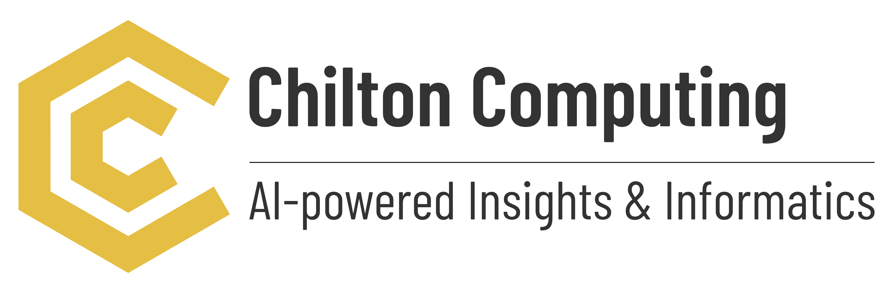

## Chilton Computing Ltd, Oxfordshire, UK

[R&D department, Chilton Computing](https://chiltoncomputing.co.uk)

### Topics
- Knowledge graph construction, extension, and self-maintenance
- Knowledge graph empowered NLP for knowledge identification, extraction, and linkage
- Knowledge graph empowered AI to improve clinical relevance and accuracy of medical report genration
- Knowledge graph in medical device regulatory context to provide regulatory guidance and expert support
- Knowledge graph in people-machine interactions to provide augmented knowledge context in clinical, healthcare, engineering and manufacturing operational context

---

